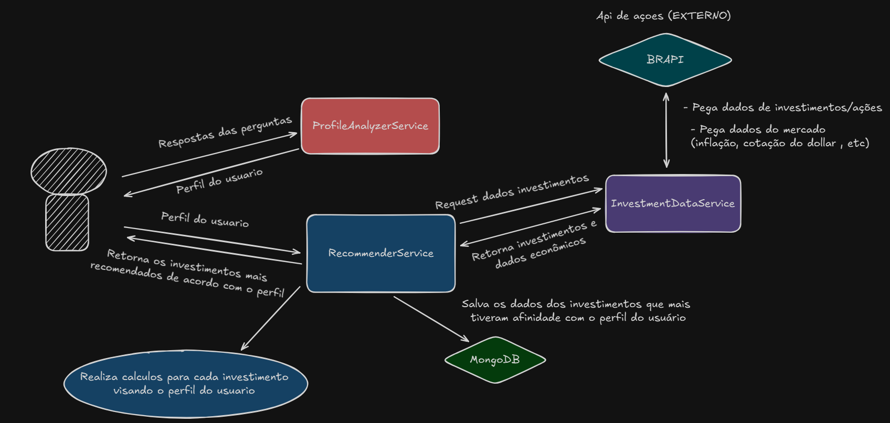
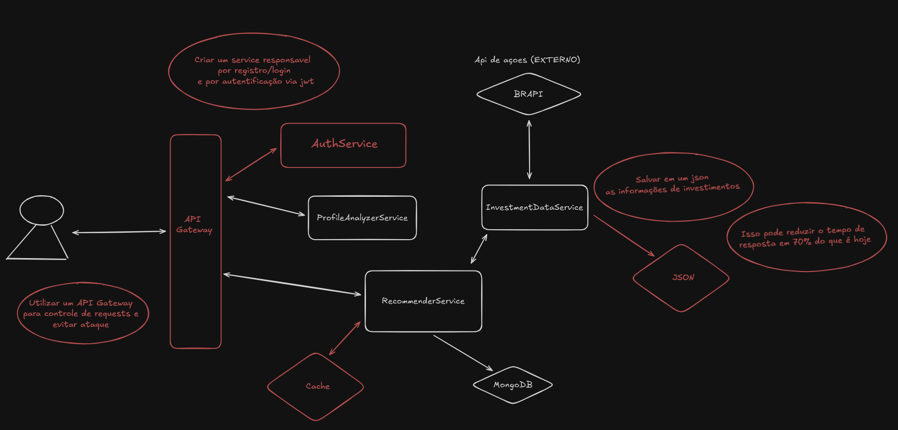

# 💸 Sistema de Recomendação de Investimentos

🔗 **Acesse o projeto:** [https://v0-investimento-perfil.vercel.app/](https://v0-investimento-perfil.vercel.app/)

Este projeto é um **sistema de recomendação de investimentos personalizado**, que utiliza o perfil do usuário como base para sugerir ativos (ações, fundos e investimentos) alinhados aos seus objetivos, tolerância ao risco e interesses sociais e macroeconômicos.

---

## 🧠 Visão Geral dos Serviços

### 🔍 ProfileAnalyzerService
Responsável por analisar o perfil do investidor com base em **7 perguntas**. A partir das respostas, classifica o investidor em um dos perfis:

- **Conservador**
- **Moderado**
- **Ousado**

Além disso, identifica interesses como:
- Preocupações com **inflação** e **dólar**
- Interesse em **investimentos ESG** (com responsabilidade social e ambiental)
- Necessidade de **liquidez**

#### 📥 Exemplo de entrada:
```json
{
  "userId": "maria_iniciante",
  "answers": {
    "q1": "a",
    "q2": "c",
    "q3": "a",
    "q4": "a",
    "q5": "d",
    "q6": "a",
    "q7": "a"
  },
  "monthlyInvestmentValue": 1000.00
}
```
📤 Exemplo de retorno:
```json
{
  "user": "maria_iniciante",
  "totalScore": 13,
  "profileClassification": "Conservador",
  "identifiedInterests": {
    "liquidityNeeded": false,
    "esgInterest": "none",
    "macroeconomicConcerns": [],
    "riskToleranceNotes": "Tolerância a risco alinhada ao perfil classificado."
  }
}
```
---

### 📊 InvestmentDataService
Este serviço é responsável por **buscar e organizar dados de investimentos**, como:

- Ações brasileiras e estrangeiras
- Fundos de investimento diversos
- Investimentos de renda fixa e variável

Aplica filtros básicos conforme o perfil do investidor, retornando apenas os ativos relevantes para seus interesses identificados.

---

## ⚙️ Recommender Service

Este serviço é responsável por gerar recomendações de investimentos personalizadas. Ele recebe os dados analisados do `ProfileAnalyzerService` e, com base no perfil do investidor, retorna uma lista de ativos de renda fixa e variável.

### Endpoint

```
POST localhost:8081/api/v1/recommender
```

### Estrutura do Retorno (Response)

O serviço retorna um objeto JSON contendo duas listas principais: **`FixedIncomesList`** e **`VariableIncomesList`**.

#### 1. `FixedIncomesList`

Uma lista de ativos de renda fixa recomendados. Cada objeto na lista contém os seguintes campos:

* **`name`**: Nome do ativo (ex: "Tesouro SELIC 2029").
* **`type`**: Tipo do ativo (ex: "Tesouro Selic").
* **`indexerRate`**: Taxa do indexador (ex: 14.75).
* **`indexer`**: Nome do indexador (ex: "Selic").
* **`isTaxExempt`**: Booleano que indica se há isenção de imposto de renda.
* **`dailyLiquidity`**: Booleano que indica se o ativo possui liquidez diária.
* **`maturityDate`**: Data de vencimento do título (formato: "AAAA-MM-DD").
* **`minimumInvestmentAmount`**: Valor mínimo para investir no ativo.
* **`issuer`**: Emissor do título (ex: "Tesouro Nacional").
* **`issuerRiskScore`**: Pontuação de risco do emissor (quanto menor, mais seguro).
* **`source`**: Fonte da informação (ex: "Tesouro Direto / XP Investimentos").

#### 2. `VariableIncomesList`

Uma lista de ativos de renda variável (ações) recomendados. Cada objeto na lista contém os seguintes campos:

* **`ticket`**: O ticker da ação (ex: "CPFE3F").
* **`longName`**: Nome completo da empresa (pode ser nulo).
* **`currency`**: Moeda do ativo (ex: "BRL").
* **`logoUrl`**: URL para o logo da empresa.
* **`regularMarketPrice`**: Preço atual da ação no mercado.
* **`regularMarketChange`**: Variação do preço no dia (em valor monetário).
* **`regularMarketChancePercent`**: Variação do preço no dia (em percentual).
* **`score`**: Pontuação interna do sistema de recomendação, indicando a força da sugestão.

### Exemplo de Retorno

Abaixo está um exemplo completo da resposta da API:

```json
{
    "FixedIncomesList": [
        {
            "name": "Tesouro SELIC 2029",
            "type": "Tesouro Selic",
            "indexerRate": 14.75,
            "indexer": "Selic",
            "isTaxExempt": false,
            "dailyLiquidity": true,
            "maturityDate": "2029-03-01",
            "minimumInvestmentAmount": 159.21,
            "issuer": "Tesouro Nacional",
            "issuerRiskScore": 1,
            "source": "Tesouro Direto / XP Investimentos"
        }
    ],
    "VariableIncomesList": [
        {
            "ticket": "CPFE3F",
            "longName": null,
            "currency": "BRL",
            "logoUrl": "[https://icons.brapi.dev/icons/CPFE3F.svg](https://icons.brapi.dev/icons/CPFE3F.svg)",
            "regularMarketPrice": 38.7,
            "regularMarketChange": -0.05,
            "regularMarketChancePercent": -0.129,
            "score": 8.25
        },
        {
            "ticket": "BPAC5F",
            "longName": null,
            "currency": "BRL",
            "logoUrl": "[https://icons.brapi.dev/icons/BPAC5F.svg](https://icons.brapi.dev/icons/BPAC5F.svg)",
            "regularMarketPrice": 10.81,
            "regularMarketChange": -0.12,
            "regularMarketChancePercent": -1.098,
            "score": 8.25
        },
        {
            "ticket": "ELET3F",
            "longName": null,
            "currency": "BRL",
            "logoUrl": "[https://icons.brapi.dev/icons/ELET3F.svg](https://icons.brapi.dev/icons/ELET3F.svg)",
            "regularMarketPrice": 50.85,
            "regularMarketChange": 1.85,
            "regularMarketChancePercent": 3.776,
            "score": 5.25
        }
    ]
}
```

---

## 📦 Estrutura do Repositório

```bash
.
├── .github/workflows         # Configurações de CI/CD
├── AuthService               # Serviço de autenticação
├── InvestmentDataService     # Serviço de coleta de dados de ativos
├── ProfileAnalyzerService    # Serviço de análise de perfil do investidor
├── RecommenderService        # Serviço de recomendação personalizada
├── docker-compose.yml        # Orquestração dos serviços
└── README.md                 # Documentação do projeto
```

---

---

## 📖 Documentação da API (Swagger)

A documentação detalhada de cada endpoint pode ser encontrada nos respectivos links do Swagger:

**Observação:** Com exceção do `AuthService` (para login e registro), todos os outros endpoints (`ProfileAnalyzerService`, `InvestmentDataService` e `RecommenderService`) requerem um token de autenticação (JWT) obtido no login para serem acessados.

- **AuthService (Autenticação):**
  [http://ec2-52-207-230-152.compute-1.amazonaws.com:8082/swagger-ui/index.html#/](http://ec2-52-207-230-152.compute-1.amazonaws.com:8082/swagger-ui/index.html#/)

- **ProfileAnalyzerService (Análise de Perfil):**
  [http://ec2-52-207-230-152.compute-1.amazonaws.com:8080/swagger-ui/index.html#/](http://ec2-52-207-230-152.compute-1.amazonaws.com:8080/swagger-ui/index.html#/)

- **InvestmentDataService (Dados de Investimentos):**
  [http://ec2-3-88-201-1.compute-1.amazonaws.com:8083/swagger-ui/index.html#/](http://ec2-3-88-201-1.compute-1.amazonaws.com:8083/swagger-ui/index.html#/)

- **RecommenderService (Recomendação):**
  [http://ec2-3-88-201-1.compute-1.amazonaws.com:8081/swagger-ui/index.html#/](http://ec2-3-88-201-1.compute-1.amazonaws.com:8081/swagger-ui/index.html#/)


---

## 🚀 Executando o Projeto Localmente

Para executar o projeto em seu ambiente local, siga os passos abaixo:

**1. Clone o repositório:**
```bash
git clone https://github.com/Cavasini/Challenge--Sistema-de-recomenda-o-de-investimentos.git
```

**2. Inicie os containers com Docker Compose:**
Navegue até a pasta local e execute o comando abaixo. Com isso, todos os serviços e o banco de dados serão inicializados em um container Docker e poderão ser testados localmente.
```bash
cd local
docker-compose up -d
```
---

## ☁️ Deploy em Produção

Este sistema foi **deployado na AWS** utilizando **boas práticas de CI/CD**, garantindo:

- Automatização do pipeline de build, teste e deploy
- Versionamento contínuo
- Integração com workflows do GitHub Actions

---

## 📌 Status do Projeto

✅ Fase inicial com os serviços principais implementados.  
🚀 Deploy funcional na nuvem com CI/CD.  
🔜 Em desenvolvimento contínuo para integração com fontes de dados externas e APIs de mercado.

---

## Desenho da Arquitetura do Sistema



## Desenho das melhorias futuras para o sistema


---


## 👨‍💻 Autor

- Julia Amorim - RM99609
- Lana Leite - RM551143
- Matheus Cavasini - RM97722


